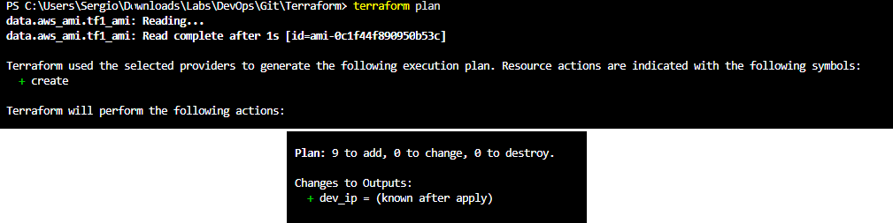
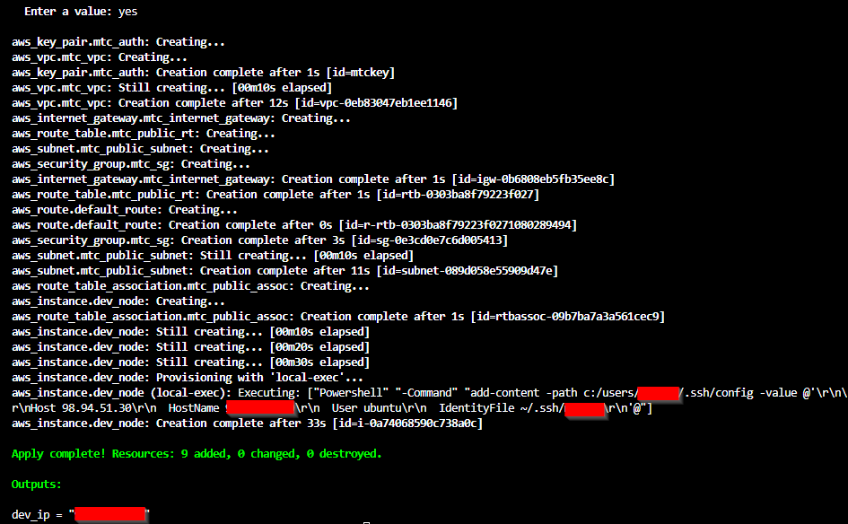
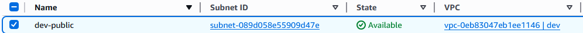
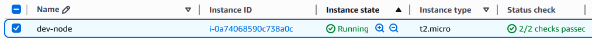
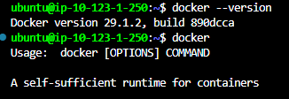
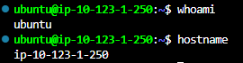

# Terraform AWS Infrastructure Project

This repository showcases an AWS environment deployed with Terraform.  
It includes a VPC, subnet, internet gateway, route table, security group, key pair, EC2 instance, Docker installation via cloud-init, and OS-aware SSH configuration.

---

## Table of Contents

- [Prerequisites](#prerequisites)
- [Project Structure](#project-structure)
- [Terraform Configuration](#terraform-configuration)
- [Variable Files](#variable-files)
- [Templates and Scripts](#templates-and-scripts)
- [Deployment Instructions](#deployment-instructions)
- [Screenshots](#screenshots)
- [What This Project Demonstrates](#what-this-project-demonstrates)

---

## Prerequisites

- Terraform `v1.x`
- AWS CLI configured with a profile (e.g., `vscode`)
- SSH keypair for EC2 access (`~/.ssh/mtckey`)

---

## Project Structure

- `main.tf` - Core AWS resources (VPC, subnet, IGW, route tables, security group, key pair, EC2 instance)
- `providers.tf` - Provider configuration
- `datasources.tf` - AMI data source
- `variables.tf` - Terraform variables
- `outputs.tf` - Terraform outputs
- `terraform.tfvars` / `dev.tfvars` - Variable overrides for different environments
- `userdata.tpl` - Cloud-init script to install Docker
- `windows-ssh-config.tpl` - Windows SSH config template

---

## Terraform Configuration

### `providers.tf`
```hcl
terraform {
  required_providers {
    aws = {
      source  = "hashicorp/aws"
      version = "~> 6.0"
    }
  }
}

provider "aws" {
  region                   = "us-east-1"
  shared_credentials_files = ["~/.aws/credentials"]
  profile                  = "vscode"
}
````

### `datasources.tf`

```hcl
data "aws_ami" "tf1_ami" {
  most_recent = true
  owners      = ["099720109477"]

  filter {
    name   = "name"
    values = ["ubuntu/images/hvm-ssd-gp3/ubuntu-noble-24.04-amd64-server-*"]
  }
}
```

### `variables.tf`

```hcl
variable "host_os" {
  type    = string
  default = "windows"
}
```

### `outputs.tf`

```hcl
output "dev_ip" {
  value = aws_instance.dev_node.public_ip
}
```

---

## Variable Files

### `terraform.tfvars`

```hcl
host_os = "windows"
```

### `dev.tfvars`

```hcl
host_os = "osx"
```

**Usage:**

```bash
terraform apply -var-file="dev.tfvars"
```

---

## Templates and Scripts

### `userdata.tpl` (Cloud-init for Docker installation)

```bash
#!/bin/bash
sudo apt-get update -y &&
sudo apt-get install -y \
apt-transport-https \
ca-certificates \
curl \
gnupg-agent \
software-properties-common &&
curl -fsSL https://download.docker.com/linux/ubuntu/gpg | sudo apt-key add - &&
sudo add-apt-repository "deb [arch=amd64] https://download.docker.com/linux/ubuntu $(lsb_release -cs) stable" &&
sudo apt-get update -y &&
sudo apt-get install -y docker-ce docker-ce-cli containerd.io &&
sudo usermod -aG docker ubuntu
```

### `windows-ssh-config.tpl`

```powershell
add-content -path c:/users/Sergio/.ssh/config -value @'

Host ${hostname}
  HostName ${hostname}
  User ${user}
  IdentityFile ${identityfile}
'@
```

---

## Deployment Instructions

### Windows (default)

```bash
terraform init
terraform apply
```

### macOS / Linux

```bash
terraform apply -var-file="dev.tfvars"
```

---

## Screenshots

**Terraform Plan / Apply Output**



**AWS Console Resources**




**Docker Installation / EC2 Access**



> Screenshots are stored in the `screenshots/` directory.

---

## What This Project Demonstrates

* VPC and subnet design
* Internet gateway and route configuration
* Security group configuration
* EC2 provisioning
* Cloud-init automation (Docker installation)
* Terraform data sources, variables, templates, and provisioners
* OS-aware SSH automation
* Hands-on AWS infrastructure experience

````
